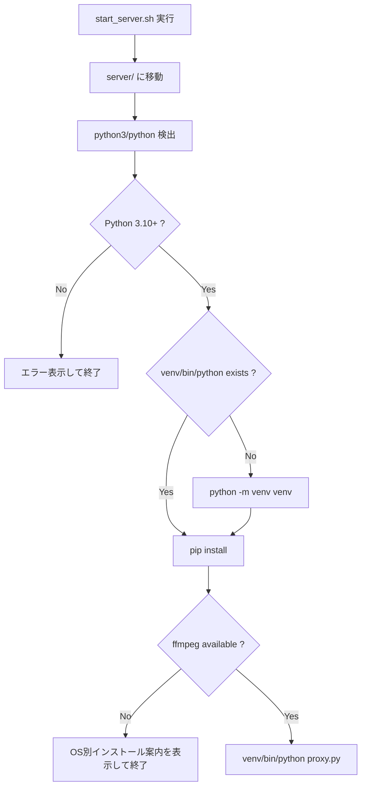

# システム設計書 - StreaMu Mac/Linux Server Startup
**RDD:** `RDD-2026-05-16-1406.md`
**作成日:** 2026-05-16

## 1. 全体方針
- Mac/Linux の導線改善は `server/start_server.sh` の追加と README 更新に限定する。
- Windows の EXE/BAT、`ffmpeg_bootstrap.py`、`proxy.py` の起動時依存解決は変更しない。
- `start_server.sh` はユーザー環境を自動変更せず、Python venv 作成と Python 依存インストールのみを行う。
- `ffmpeg` はローカル `server/ffmpeg` または PATH 上の `ffmpeg` を許可し、未検出時は導入案内を表示して終了する。

## 2. 新規ファイル

### `server/start_server.sh`

Shell script functions:

```sh
print_header()
find_python()
check_python_version()
ensure_venv()
install_dependencies()
check_ffmpeg()
print_ffmpeg_help()
start_server()
```

Key behavior:

```sh
SCRIPT_DIR="$(CDPATH= cd -- "$(dirname -- "$0")" && pwd)"
cd "$SCRIPT_DIR"
```

- `find_python`: `python3`, `python` の順に確認する。
- `check_python_version`: Python から `sys.version_info >= (3, 10)` を判定する。
- `ensure_venv`: `venv/bin/python` がなければ `$PYTHON_CMD -m venv venv` を実行する。
- `install_dependencies`: `venv/bin/python -m pip install --upgrade pip` と `venv/bin/python -m pip install -r requirements.txt` を実行する。
- `check_ffmpeg`: `./ffmpeg` が実行可能、または `command -v ffmpeg` が成功すれば OK とする。
- `print_ffmpeg_help`: `uname -s` で `Darwin` とそれ以外を分岐し、macOS/Homebrew、Debian/Ubuntu、Fedora、Arch の例を表示する。
- `start_server`: `venv/bin/python proxy.py` を実行する。

## 3. 既存ファイルの変更

### `README.md`

英語セクション:
- Quick Start の server 手順は Windows EXE を維持する。
- Python 版の Mac/Linux 起動手順を以下に変更する。

Before:
```md
Mac / Linux:
```bash
cd server
venv/bin/python proxy.py
```
```

After:
```md
Mac / Linux:
```bash
cd server
chmod +x start_server.sh
./start_server.sh
```
```

- FFmpeg troubleshooting は、Mac/Linux では `start_server.sh` が検出と案内を行う旨を追記する。

日本語セクション:
- 英語セクションと同じ内容を日本語で反映する。
- 「Python版の場合は `ffmpeg.exe`」のような Windows 寄り表現を、Mac/Linux では `ffmpeg` または PATH として明確化する。

## 4. 各機能の詳細設計



- FR-1: `server/start_server.sh` を新規追加する。
- FR-2: `check_python_version` で実装する。
- FR-3: `ensure_venv` で実装する。
- FR-4: `install_dependencies` で実装する。
- FR-5: `check_ffmpeg` と `print_ffmpeg_help` で実装する。
- FR-6: `start_server` で実装する。
- FR-7: `README.md` の英語・日本語手順を更新する。

## 5. 状態設計

新規の永続状態、フラグ、設定値は追加しない。

| 変数 | 型 | 初期値 | セット条件 | クリア条件 | 残留リスク |
|------|----|--------|-----------|-----------|-----------|
| `PYTHON_CMD` | shell variable | unset | Python 検出成功時 | プロセス終了時 | `python` が別バージョンを指す環境では `python3` を優先する |
| `VENV_PYTHON` | shell variable | `venv/bin/python` | 起動時 | プロセス終了時 | venv 作成失敗時はエラー終了 |

## 6. 実装順序
1. `server/start_server.sh` を追加する。
2. README の英語 Mac/Linux 手順を更新する。
3. README の日本語 Mac/Linux 手順を更新する。
4. 構文確認として `bash -n server/start_server.sh` を実行する。
5. 可能なら Windows 上の MSYS2 bash で `start_server.sh` の初期チェックを実行する。

## 7. 影響ファイル一覧

| ファイル | 変更種別 | 内容 |
|----------|----------|------|
| `server/start_server.sh` | 新規 | Mac/Linux 用ワンコマンド起動スクリプト |
| `README.md` | 変更 | Mac/Linux のセットアップ・起動・FFmpeg案内更新 |
